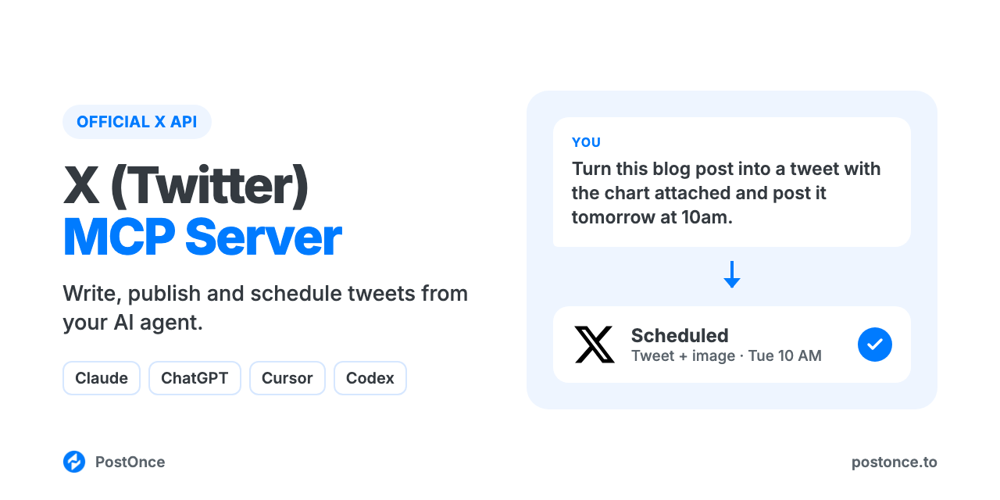

<p align="center"></p>

# X (Twitter) MCP Server

X (Twitter) MCP server for Claude, ChatGPT, Cursor and Codex. Your AI agent can write, publish and schedule tweets (X posts) with images, a GIF or a video through X's official API. There's no scraping, no browser automation and no X developer app to set up.

It runs on [PostOnce](https://postonce.to)'s hosted MCP server and comes with Twitter writing skills, so your agent knows what a good tweet looks like before it posts one.

```
You:    Turn this changelog into a tweet and post it tomorrow at 10am.
Claude: Drafted it with the x-tweet-generator skill: 241 characters, the
        change in line 1, no hashtags, the link at the end.
        Scheduled on PostOnce for Wed 10:00 on @acme.
```

## What you can do

| Ask your agent to | How it works |
| --- | --- |
| Publish a tweet now (up to 280 characters, or 4,000 if the account had X Premium when you connected it) | `create_post` on your connected X account |
| Schedule a tweet for later | `create_post` with `publish_at` |
| Post up to 4 images, or 1 GIF, or 1 video (up to 2 minutes without Premium) | `create_upload_url`, upload, then `create_post` with `media` |
| Save a draft to finish later | `create_draft` |
| Check whether a tweet went out, and get its URL | `get_post` |
| Change or cancel a scheduled tweet | `update_post`, `cancel_post` |
| Post the same thing to X and other platforms | Add more targets to `create_post` (LinkedIn, Instagram, TikTok, YouTube, Threads, Facebook, Pinterest, Bluesky) |

Not supported: threads as reply chains, replies, quote posts, polls, reading your timeline or mentions, analytics, DMs, and editing or deleting tweets that are already published. Text over the character limit is cut off, not rejected, so keep each post within it. This server publishes; it doesn't browse X for you.

## Setup (about a minute)

You need a [PostOnce account](https://postonce.to) (free for 7 days, no card) with your X account connected. Any X account works.

**Claude (claude.ai and desktop) and ChatGPT:** add a custom connector with the URL below and sign in with PostOnce. No API key.

```
https://postonce.to/mcp
```

Step-by-step: [Claude](https://postonce.to/integrations/claude) · [ChatGPT](https://postonce.to/integrations/chatgpt)

**Claude Code, Codex and Cursor:** install this repo as a plugin. It adds the MCP connection and the skills below together. Create an API key in [PostOnce preferences](https://postonce.to/dashboard/preferences) and give it to your client as the `POSTONCE_API_KEY` environment variable. Never paste the key into chat.

```bash
# Claude Code
claude plugin marketplace add postoncehq/plugins
claude plugin install x-mcp@postoncehq
```

Step-by-step: [Claude Code](https://postonce.to/integrations/claude-code) · [Codex](https://postonce.to/integrations/codex) · [Cursor](https://postonce.to/integrations/cursor)

**Any other MCP client:** point it at `https://postonce.to/mcp` (Streamable HTTP) with the header `Authorization: Bearer <your PostOnce API key>`.

## Skills included

| Skill | What it does |
| --- | --- |
| [`x-tweet-generator`](skills/x-tweet-generator/SKILL.md) | Writes single tweets in your voice: a first line that earns the stop, one idea, within 280 characters (or 4,000 for Premium accounts). |
| [`x-thread-generator`](skills/x-thread-generator/SKILL.md) | Turns a topic, blog post or transcript into a 5–15 post Twitter thread, then gives you a way to publish it that actually works with this server. |
| [`x-bio-generator`](skills/x-bio-generator/SKILL.md) | Writes a 160-character X (Twitter) bio, display name and pinned tweet idea for you to paste into your profile. |
| [`x-tweet-formatter`](skills/x-tweet-formatter/SKILL.md) | Formats tweets: line breaks, Unicode bold and italic (with their accessibility and search costs), and splitting text that's over the limit. |
| [`x-content-calendar`](skills/x-content-calendar/SKILL.md) | Plans 1–4 weeks of tweets from your goals or a source you want to repurpose, drafts each one and schedules them on approval. |
| [`postonce`](skills/postonce/SKILL.md) | Publishing workflow: pick the right account, upload media, schedule, and confirm the post actually went live. |

## FAQ

**Is there an official X (Twitter) MCP server?**
This server uses X's official API through PostOnce, with the OAuth permissions you grant when you connect. You don't need your own X API access.

**Can Claude post tweets?**
Yes, once it's connected to an MCP server that can publish, like this one. Claude writes the tweet, then calls `create_post`. It can post now or schedule for later.

**Is it safe for my X account?**
Yes. Tweets go through X's official API with the permissions you grant when you connect. Many Twitter MCP servers on GitHub drive a logged-in browser session or call unofficial, scraped endpoints instead, which X's terms don't allow and which can get accounts restricted or suspended.

**Do I need an X developer account or API key?**
No. PostOnce holds the X API access; you just connect your account.

**Can it post Twitter threads?**
Not as a reply chain. The `x-thread-generator` skill still writes the thread, then offers three ways to ship it: publish the first post and paste the rest as replies yourself, collapse it into one long post if your account has X Premium, or schedule the parts as standalone tweets over several days.

**Can it post long tweets?**
Yes, up to 4,000 characters if your account had X Premium (blue check) when you connected it to PostOnce. Otherwise the limit is 280. If you subscribe to Premium later, reconnect the account.

**Is it free?**
The skills and this repo are free and MIT-licensed. Publishing runs through a PostOnce account, which you can try free for 7 days without entering a card. After that, see [pricing](https://postonce.to/pricing).

## Other platforms

The same connection posts everywhere PostOnce supports. Platform repos with their own skills:
[LinkedIn MCP](https://github.com/postoncehq/linkedin-mcp) · [Instagram MCP](https://github.com/postoncehq/instagram-mcp) · [TikTok MCP](https://github.com/postoncehq/tiktok-mcp) · [YouTube MCP](https://github.com/postoncehq/youtube-mcp) · [Facebook MCP](https://github.com/postoncehq/facebook-mcp) · [Threads MCP](https://github.com/postoncehq/threads-mcp) · [Bluesky MCP](https://github.com/postoncehq/bluesky-mcp) · [Pinterest MCP](https://github.com/postoncehq/pinterest-mcp)

## License

MIT. See [LICENSE](LICENSE).
